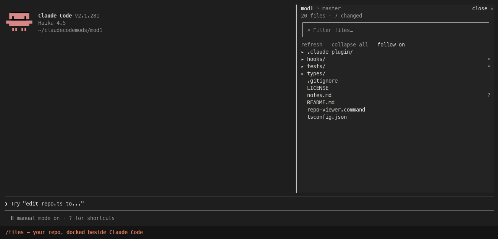

# repo-viewer

Browse, read and edit your whole repo in a pane beside Claude Code, right in the terminal.



The Claude desktop app has a file pane; the CLI didn't. **repo-viewer** is a Claude Code
[mod](https://code.claude.com/docs/en/plugins/mods/overview) that docks one on the right:

- **Tree** of the repo (`.gitignore` respected) with git marks (`M A ? D R U`) and a magenta `●` on
  every file Claude edited this session.
- **Arrow keys**: `↑ ↓` move, `→` opens a folder or file, `←` steps back out, and `←` at the top
  level hands the keys back to Claude's prompt.
- **Viewer**: syntax highlighting with line numbers, rendered markdown, `git diff` per file, PNGs
  (kitty / Ghostty).
- **Editor**: `→` on an open file edits it in place. `ctrl+s` saves, `ctrl+q` is done, `ctrl+z` undoes.
  A save never silently overwrites a file that changed on disk.
- **Follows Claude**: files open as Claude edits them, and Claude can show you a file
  ("show me the auth middleware") with its `show_file` tool.
- **Fuzzy finder**: `regtsx` → `hooks/register.tsx`, Enter opens it.

Typing anywhere outside the finder and the editor goes straight to Claude's prompt.

## Install

**Requires Claude Code 2.1.259 or newer, in fullscreen mode (`/tui fullscreen`)** for the pane to
dock on the right; otherwise it sits above the prompt.

```bash
claude plugin marketplace add kesavreddy-commits/repo-viewer
```

```bash
claude plugin install kesav@repoviewer
```

## Use

| | |
| --- | --- |
| `/files` (or `/repo`) | toggle the pane |
| `/files <path>` | open a file, or reveal a folder |
| `/files <text>` | fuzzy-find |
| click the tree | gives it the arrow keys; `Esc` gives them back |

The pane takes 40% of a wide terminal (at least 44 columns, and Claude keeps at least 70). Drag the
divider to change it, or set `width` in `/config`, beside `autoOpen` and `follow`.

It works in the desktop app's Code tab too; VS Code gets a click-only tree.

## Develop

```bash
git clone https://github.com/kesavreddy-commits/repo-viewer && cd repo-viewer
```

```bash
claude --plugin-dir . --settings '{"tui":"fullscreen"}'
```

```bash
claude plugin test .
```

`hooks/register.tsx` wires the events and does all file and git I/O; `hooks/nav.tsx` is the
keyboard `Client` (tree), `hooks/navfile.tsx` the viewer and editor inside it, `hooks/editor.ts` the
text buffer, `hooks/repo.ts` the parsing; `tree.tsx` and `viewer.tsx` draw the chrome. Run
`/plugin-types` once for editor types, then `npx -p typescript tsc -p .`.

## Contributors

- [Kesav Reddy Eswaravaka](https://github.com/kesavreddy-commits)

## License

MIT - Add a reference to my name, Kesav E. and my GitHub username if using this repo for a video please!
